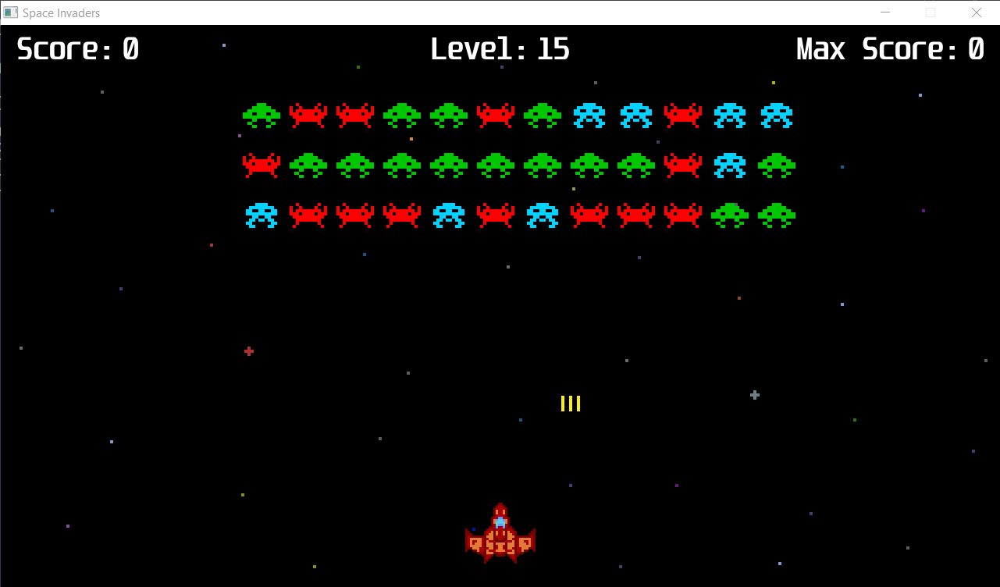

# Space Invaders
My remake of the original Space Invaders game 
  


## Requirements  
- SDL
- SDL_ttf
- SDL_image
- make (optional)

## Installation
If you are on Windows, you can use the preinstalled SDL version in SDL folder (it's the 64-bit version). If you are on Linux you can run this command to install SDL
```
sudo apt-get install libsdl2-dev libsdl2-ttf-dev libsdl2-image-dev
```
## Build
You can find two makefiles in makefiles folder. Move the one corresponding to your OS in the main folder and run 
```
make
```  
If you don't have make, run the command corresponding to your OS:  
#### Windows
```
g++ -I SDL2/include -I include -L SDL2/lib -o bin/Space_Invaders main.cpp src/level.cpp src/max_score.cpp src/select_level.cpp src/ufo.cpp src/menu.cpp src/main_menu.cpp src/score.cpp src/enemies.cpp src/spaceship.cpp src/global.cpp src/text.cpp src/init.cpp src/textures.cpp src/buttons.cpp -l mingw32 -l SDL2main -l SDL2 -l SDL2_ttf -l SDL2_image -mwindows
```
#### Linux
```
g++ -I include -o bin/Space_Invaders main.cpp src/level.cpp src/max_score.cpp src/select_level.cpp src/ufo.cpp src/menu.cpp src/main_menu.cpp src/score.cpp src/enemies.cpp src/spaceship.cpp src/global.cpp src/text.cpp src/init.cpp src/textures.cpp src/buttons.cpp -l SDL2main -l SDL2 -l SDL2_ttf -l SDL2_image

```

## Execute
To run the executable file run 
```
bin/Space_Invaders
```

## Controls
- `Esc`: exit to main menu (enabled only when you are in the select level menu)
- `Q`: quit
- `M`: exit to main menu (enabled only when you lose)
- `Enter`: try again (enabled only when you lose)
- `Space`: shoot
- `A` or `Left Arrow`: move left
- `D` or `Right Arrow`: move right
- `F`: toggle fullscreen (enabled only in main menu and in select level menu

## Notes
- sometimes, the window doesn't update correctly when passing from windowed mode to fullscreen. 
